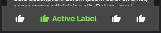

# SPHAppbar Documentation

- This component uses the [box-icons library](https://boxicons.com/).



## HTML

```html
<nav class="sc-appbar">
    <div class="sc-appbar__container">
        <div class="sc-appbar__item active">
            <a href="">
                <i class="sc-appbar__item__icon bx bxs-like" aria-hidden="true"></i>
                <span class="sc-appbar__item__label">Active Label</span>
            </a>
        </div>
        <div class="sc-appbar__item">
            <a href="">
                <i class="sc-appbar__item__icon bx bxs-like" aria-hidden="true"></i>
                <span class="sc-appbar__item__label">Active Label</span>
            </a>
        </div>
        <div class="sc-appbar__item">
            <a href="">
                <i class="sc-appbar__item__icon bx bxs-like" aria-hidden="true"></i>
                <span class="sc-appbar__item__label">Active Label</span>
            </a>
        </div>
        <div class="sc-appbar__item">
            <a href="">
                <i class="sc-appbar__item__icon bx bxs-like" aria-hidden="true"></i>
                <span class="sc-appbar__item__label">Active Label</span>
            </a>
        </div>
    </div>
</nav>
```

## SCSS/CSS

### CSS Classes & HTML Attributes API

| Class | Effect |
|-------|--------|
| `.sph-appbar` | The main appbar component. |
| `.sph-appbar__container` | The wrapper around the `.appbar__item` elements. |
| `.sph-appbar__item` | The navigation items inside the appbar. |
| `.sph-appbar__item__icon` | The icon element of the appbar. |
| `.sph-appbar__item__icon` | The label element of the appbar. |
| Adding the `active` class | Renders the appbar item in its active state. |

### SCSS variables API (using `with ()`)

| Property | Effect |
|----------|--------|
| `$appbar-fill` | Changes the component's default state background color. |
| `$appbar-ink` | Changes the component's default state text color. |
| `$appbar-radius` | Changes the component's border radius. |
| `$appbar-elevation-color` | Changes the component's elevation/shadow color.  |
| `$appbar-active-ink` | Changes the component's active state text color. |
| `$appbar-label-size` | Changes the component's label size. |
| `$appbar-icon-size` | Changes the component's icon size. |

```scss
@use '~@surpathhub/ugnay/SPHAppbar' with (
    $appbar-fill: black,
    $appbar-elevation-color: blue
);

@include SPHAppbar.use();
```

### CSS custom properties API

| Property | Effect |
|----------|--------|
| `--sph-appbar-fill` | Changes the component's default state background color. |
| `--sph-appbar-ink` | Changes the component's default state text color. |
| `--sph-appbar-radius` | Changes the component's border radius. |
| `--sph-appbar-active-ink` | Changes the component's active state text color. |
| `--sph-appbar-label-size` | Changes the component's label size. |
| `--sph-appbar-icon-size` | Changes the component's icon size. |

```css
.sph-appbar {
    --sph-appbar-fill: blue;
    --sph-appbar-active-ink: yellow;
    --sph-appbar-icon-ink: #FF9900;
}
```
