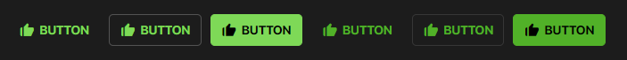

# SPHButton Documentation

- This component uses the [box-icons library](https://boxicons.com/).



## HTML

```html
<button class="sph-button">
    <i class="sph-button__icon bx bxs-like" aria-hidden="true"></i>
    <span class="sph-button__label">BUTTON</span>
</button>
```

## SCSS/CSS

### CSS Classes & HTML Attributes API

| Class | Effect |
|-------|--------|
| `.sph-button` | The main button component. |
| `.sph-button__icon` | The icon element of the button component. |
| `.sph-button__label` | The label element of the button component. |
| `.sph-button--outlined` | An additional class to be put on top of the `.sph-button` class to render the component with its outlined style. |
| `.sph-button--filled` | An additional class to be put on top of the `.sph-button` class to render the component with its filled style. |
| Adding the `disabled` attribute | Renders the component in its disabled state. |

### The `use()` mixin API

- The parameters in the `use()` mixin API only accept css custom properties from the `theme` config.

| Parameter | Effect |
|-----------|--------|
| `$types` | Selectively renders the styles of the types of buttons you want to use. Available types are: `all` (*this
is the default*), `outlined`, `filled`. You can also list multiple types. |

### SCSS variables API (using `with ()`)

| Property | Effect |
|----------|--------|
| `$button-fill` | Changes the component's default state background color. |
| `$button-ink` | Changes the component's default state text color. |
| `$button-size` | Changes the component's text size. |
| `$button-elevation-color` | Changes the component's elevation/shadow color.  |
| `$button-active-fill` | Changes the component's active state background color. |
| `$button-disabled-fill` | Changes the component's disabled state background color.  |
| `$button-radius` | Changes the component's border radius. |
| `$button-icon-ink` | Changes the component's icon color. |
| `$button-icon-size` | Changes the component's icon size. |

```scss
@use '~@surpathhub/ugnay/SPHButton' with (
    $button-fill: blue,
    $button-ink: #ffffff,
    $button-elevation-color: #ffffff
);

@include SPHButton.use($type: 'all');
```

### CSS custom properties API

| Property | Effect |
|----------|--------|
| `--sph-button-fill` | Changes the component's default state background color. |
| `--sph-button-ink` | Changes the component's default state text color. |
| `--sph-button-size` | Changes the component's text size. |
| `--sph-button-active-fill` | Changes the component's active state background color. |
| `--sph-button-disabled-fill` | Changes the component's disabled state background color.  |
| `--sph-button-radius` | Changes the component's border radius. |
| `--sph-button-icon-ink` | Changes the component's icon color. |
| `--sph-button-icon-size` | Changes the component's icon size. |

```css
.sph-button {
    --sph-button-fill: blue;
    --sph-button-ink: #FFF;
    --sph-button-icon-ink: #FF9900;
}
```