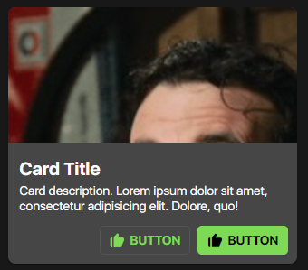

# SPHCard Documentation

- This component uses the [box-icons library](https://boxicons.com/).



## HTML

- The SPHCard component has three different modules, the `content module`, the `media module`, and the `action module`.
- Below is the code snippet of all the modules combined.
- Feel free to remove some modules depending on the need of your website /

#### About the `.sph-card__actions` module...

- Actions are, by default, made of SPHButton components. Calling the SPHButton component style is a must when you want
  to have card actions.
- Actions however are replaceable with your own custom card action style.

```html
<div class="sph-card">

    <!-- MEDIA MODULE -->
    <div class="sph-card__media">
        
    </div>

    <!-- CONTENT MODULE -->
    <div class="sph-card__content">
        <h2 class="sph-card__title">CARD TITLE</h2>
        <p class="sph-card__description">Card description... Lorem ipsum dolor sit amet, consectetur adipisicing elit.
            Eaque, illum.</p>
    </div>

    <!-- ACTIONS MODULE -->
    <div class="sph-card__actions">
        <button class="sph-button sph-button--outlined">
            <i class="bx bxs-like sph-button__icon"></i>
            <span class="sph-button__label">BUTTON</span>
        </button>
        <button class="sph-button sph-button--filled">
            <i class="bx bxs-like sph-button__icon"></i>
            <span class="sph-button__label">BUTTON</span>
        </button>
    </div>

</div>
```

## SCSS/CSS

### CSS Classes & HTML Attributes API

| Class | Effect |
|-------|--------|
| `.sph-card` | The main card component |
| `.sph-card__media` | The media module of the card. This is where you put your card images |
| `.sph-card__content` | The content module of the card. This is where you put the card title, and card description |
| `.sph-card__actions` | The actions module of the card. This is where you put the call-to-action elements of the card (i.e. SPHButton). |
| `.sph-card__title` | The card title. |
| `.sph-card__description` | The card description. |
| `.sph-card__action` | Provides special styling for the SPHButton components to be used in the context of a card. |

### SCSS variables API (using `with ()`)

| Property | Effect |
|----------|--------|
| `$card-fill` | Changes the component's default state background color. |
| `$card-ink` | Changes the component's default state text color. |
| `$card-radius` | Changes the component's border radius. |
| `$card-elevation-color` | Changes the component's elevation/shadow color.  |
| `$card-title-size` | Changes the card's title size. |
| `$card-description-size` | Changes the card's description size. |

```scss
@use '~@surpathhub/ugnay/SPHCard' with (
    $card-elevation-color: #ffffff
);

@include SPHCard.use();
```

### CSS custom properties API

| Property | Effect |
|----------|--------|
| `--sph-card-fill` | Changes the component's default state background color. |
| `--sph-card-ink` | Changes the component's default state text color. |
| `--sph-card-radius` | Changes the component's border radius. |
| `--sph-card-title-size` | Changes the card's title size. |
| `--sph-card-description-size` | Changes the card's description size. |

```css
.sph-card {
    --sph-card-fill: blue;
    --sph-card-ink: #FFF;
    --sph-card-icon-ink: #FF9900;
}
```