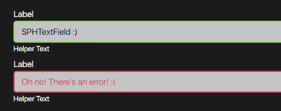

# SPHTextField Documentation



## HTML
```html
<div class="sph-text-field">
    <label class="sph-text-field__label" for="your-id-here">Label</label>
    <input class="sph-text-field__input" type="text" id="your-id-here" />
    <small class="sph-text-field__helper">Helper Text</small>
</div>
```

## SCSS

### CSS Classes & HTML Attributes API
| Class | Effect |
|-------|--------|
| `.sph-text-field` | The main text field component. |
| `.sph-text-field__label` | The component's label element. |
| `.sph-text-field__input` | The component's input field element. |
| `.sph-text-field__helper` | The component's helper text element. This can contain error messages, character limit text, or any text that helps identify a fairly vague input label. |
| `.sph-text-field--elevated` | An additional class to be put on top of the `.sph-text-field` class to render the component in its variant with elevation. |
| `.error` | An additional class to be put on top of the `.sph-text-field` class to render the component in its error state. |

### SCSS variables API (using `with ()`)

| Property | Effect |
|----------|--------|
| `$text-field-fill` | Changes the component's default state background color. |
| `$text-field-ink` | Changes the component's default state text color. |
| `$text-field-size` | Changes the component's text size. |
| `$text-field-radius` | Changes the component's border radius. |
| `$text-field-elevation-color` | Changes the component's elevation/shadow color.  |
| `$text-field-label-ink` | Changes the component's label text color. |
| `$text-field-helper-ink` | Changes the component's helper text color. |
| `$text-field-focused-border` | Changes the component's border color when focused. |

```scss
@use '~@surpathhub/ugnay/SPHTextField' with (
    $text-field-radius: 0.7rem
);

@include SPHTextField.use();
```

#### CSS custom properties API

| Property | Effect |
|----------|--------|
| `--sph-text-field-fill` | Changes the component's default state background color. |
| `--sph-text-field-ink` | Changes the component's default state text color. |
| `--sph-text-field-size` | Changes the component's text size. |
| `--sph-text-field-radius` | Changes the component's border radius. |
| `--sph-text-field-label-ink` | Changes the component's label text color. |
| `--sph-text-field-helper-ink` | Changes the component's helper text color. |
| `--sph-text-field-focused-border` | Changes the component's border color when focused. |

```css
.sph-text-field {
    --sph-text-field-fill: blue;
    --sph-text-field-ink: #FFF;
}
```
