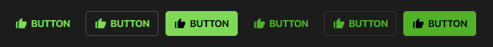

## SPHButton Documentation
- This component uses the [box-icons library](https://boxicons.com/).



### HTML
```html
<button class="sph-button">
    <i class="sph-button__icon bx bxs-like" aria-hidden="true"></i>
    <span class="sph-button__label">BUTTON</span>
</button>
```

### SCSS
- Provided below is the code snippet, and the API of the component style.
### CSS Classes & HTML Attributes API
| Class | Effect |
|-------|--------|
| `.sph-button--outlined`   | Renders the component with its outlined style. |
| `.sph-button--filled`    | Renders the component with its filled style. |
| Adding the `disabled` attribute | Renders the component in its disabled state. |
#### The `use()` mixin API
- The parameters in the `use()` mixin API only accept css custom properties from the `theme` config.

| Parameter | Effect |
|-----------|--------|
| `$fill`   | Changes the overall background color of the component. |
| `$ink`    | Changes the overall text color of all the component. |
| `$radius` | Changes the overall border-radius of the component. |
#### CSS custom properties API
| Property | Effect |
|----------|--------|
| `--sph-button-active-fill`   | Changes the component's active state background color. |
| `--sph-button-active-border`  | Changes the component's active state border color. |
| `--sph-button-disabled-fill`  | Changes the component's disabled state background color.  |
| `--sph-button-disabled-border` | Changes the component's disabled state border color. |
```scss
@use '~@surpathhub/ugnay/components/SPHButton';

@include SPHButton.use(
    $fill: secondary,
    $ink: on-secondary,
    $radius: small-radius
) {
    --sph-button-active-fill: #custom-color;
    --sph-button-active-border: #custom-color;
    --sph-button-disabled-fill: #custom-color;
    --sph-button-disabled-border: #custom-color;
};
```