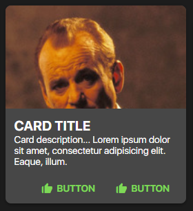

## SPHCard Documentation
- This component uses the [box-icons library](https://boxicons.com/).



### HTML
- The SPHCard component has three different modules, the `content module`, the `media module`, and the `action module`.
- Below is the code snippet of all the modules combined.
- Feel free to remove some modules depending on the need of your website / 
#### About the `.sph-card__actions` module...
- Actions are, by default, made of SPHButton components. Calling the SPHButton component style is a must when you want to have card actions.
- Actions however are replaceable with your own custom card action style.
```html
<div class="sph-card">
    
    <!-- MEDIA MODULE -->
    <div class="sph-card__img">
        
    </div>
    
    <!-- CONTENT MODULE -->
    <div class="sph-card__content">
        <h2 class="sph-card__title">CARD TITLE</h2>
        <p class="sph-card__description">Card description... Lorem ipsum dolor sit amet, consectetur adipisicing elit. Eaque, illum.</p>
        
        <!-- ACTION MODULE -->
        <div class="sph-card__actions">
            <button class="sph-button sph-button--outlined">
                <i class="bx bxs-like sph-button__icon"></i>
                <span class="sph-button__label">BUTTON</span>
            </button>
            <button class="sph-button sph-button--filled">
                <i class="bx bxs-like sph-button__icon"></i>
                <span class="sph-button__label">BUTTON</span>
            </button>
        </div>
        
    </div>
    
</div>
```
### SCSS
- Provided below is the code snippet, and the API of the component style.
#### The `use()` mixin API
- The parameters in the `use()` mixin API only accept css custom properties from the `theme` config.

| Parameter | Effect                                                 |
|-----------|--------------------------------------------------------|
| `$fill`   | Changes the overall background color of the component. |
| `$ink`    | Changes the overall text color of all the component    |
| `$radius` | Changes the overall border-radius of the component     |
```scss
@use '~@surpathhub/ugnay/components/SPHCard';

@include SPHCard.use(
    $fill: secondary,
    $ink: on-secondary,
    $radius: medium-radius
);
```