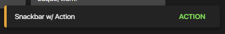

## SPHButton Documentation



### HTML
- This component contains an optional `action` module.
```html
<div class="sph-snackbar sph-snackbar--warning">
    <div class="sph-snackbar__wrap">
        <p class="sph-snackbar__label">Snackbar</p>
        <!-- ACTION MODULE -->
        <button class="sph-snackbar__action sph-button">
            <span class="sph-button__label">ACTION</span>
        </button>
    </div>
</div>
```

### SCSS
- Provided below is the code snippet, and the API of the component style.
### CSS Classes & HTML Attributes API
| Class | Effect |
|-------|--------|
| `sph-snackbar--success`   | Renders the component in its success state. |
| `sph-snackbar--warning`   | Renders the component in its warning state. |
| `sph-snackbar--error`   | Renders the component in its error state. |
#### The `use()` mixin API
- The parameters in the `use()` mixin API only accept css custom properties from the `theme` config.
- The only exceptions to this rule are the `$fill` and `$ink` properties, which accepts raw color values.

| Parameter | Effect |
|-----------|--------|
| `$fill`   | Changes the overall background color of the component. |
| `$ink`    | Changes the overall text color of all the component. |
| `$radius` | Changes the overall border-radius of the component. |

```scss
@use '~@surpathhub/ugnay/components/SPHSnackbar';

@include SPHSnackbar.use(
    $fill: #232323,
    $ink: #fff,
    $radius: small-radius
);
```