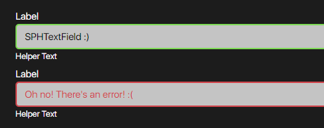

## SPHButton Documentation



### HTML
```html
<div class="sph-text-field">
    <label for="text-field-1" class="sph-text-field__label">Label</label>
    <input type="text" class="sph-text-field__input" id="text-field-1" />
    <small class="sph-text-field__helper">Helper Text</small>
</div>
```

### SCSS
- Provided below is the code snippet, and the API of the component style.
### CSS Classes & HTML Attributes API
| Class | Effect |
|-------|--------|
| `... .error`   | Renders the component in its error state. |
#### The `use()` mixin API
- The parameters in the `use()` mixin API only accept css custom properties from the `theme` config.

| Parameter | Effect |
|-----------|--------|
| `$fill`   | Changes the overall background color of the component. |
| `$ink`    | Changes the overall text color of all the component. |
| `$radius` | Changes the overall border-radius of the component. |
#### CSS custom properties API
| Property | Effect |
|----------|--------|
| `--sph-text-field-on-focus`   | Changes the component's active/focused state border color. |
| `--sph-text-field-label-ink`  | Changes the label text color. |
| `--sph-text-field-helper-ink` | Changes the helper text color. |
| `--sph-text-field-ink` | Changes the input text color. |
```scss
@use '~@surpathhub/ugnay/components/SPHTextField';

@include SPHTextField.use(
    $fill: secondary,
    $ink: on-secondary,
    $radius: small-radius
) {
    --sph-text-field-on-focus: #custom-color;
    --sph-text-field-label-ink: #custom-color;
    --sph-text-field-helper-ink: #custom-color;
};
```